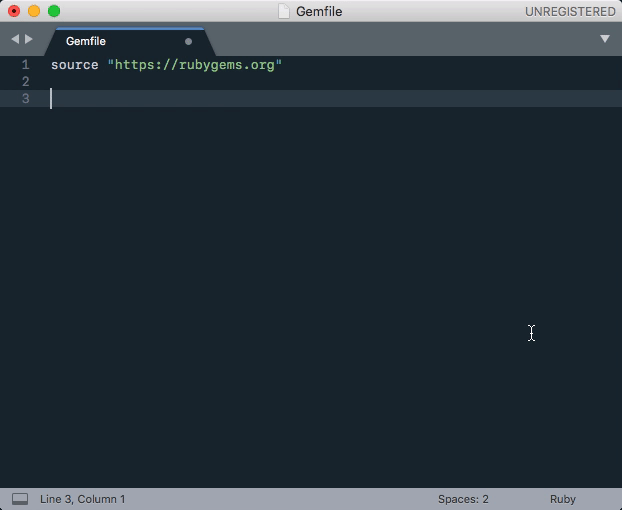

# Gemma

A Sublime Text 3 plugin for easily adding gems to your Gemfile. (Might also work with Sublime Text 2, but no guarantees, alright?)

Tired of searching RubyGems and then copy-pasting the Gemfile entry to your project? Rejoice, for your days of misspelled gems lacking version constraints are over!

## Installation

Installation via [Package Control](https://packagecontrol.io/) is recommended.

## Usage

1. Open your `Gemfile` and, on a new line, type the name of the gem you want to add
2. Hit `Cmd+Shift+P` to bring up the command palette, and start typing `Gemma` until the Gemma command is highlighted, then hit enter to run it
3. Gemma will display all the RubyGems matches, along with their latest stable versions. Select the one you want and hit enter.

BOOM! You just went from `jquery_rails` to `gem 'jquery-rails', '~> 4.1.0'` in 3 seconds flat.

## Contributing

This is literally the first and only thing I've ever written in Python. Please feel welcome to fork & open a Pull Request with any improvements!
